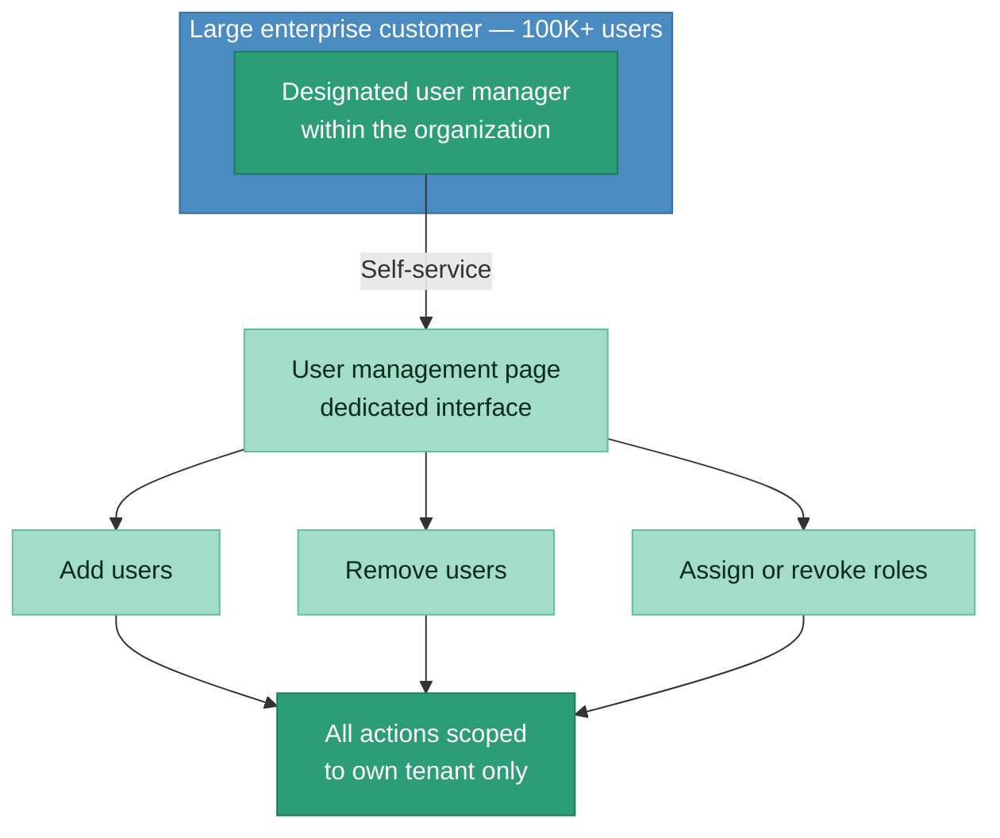
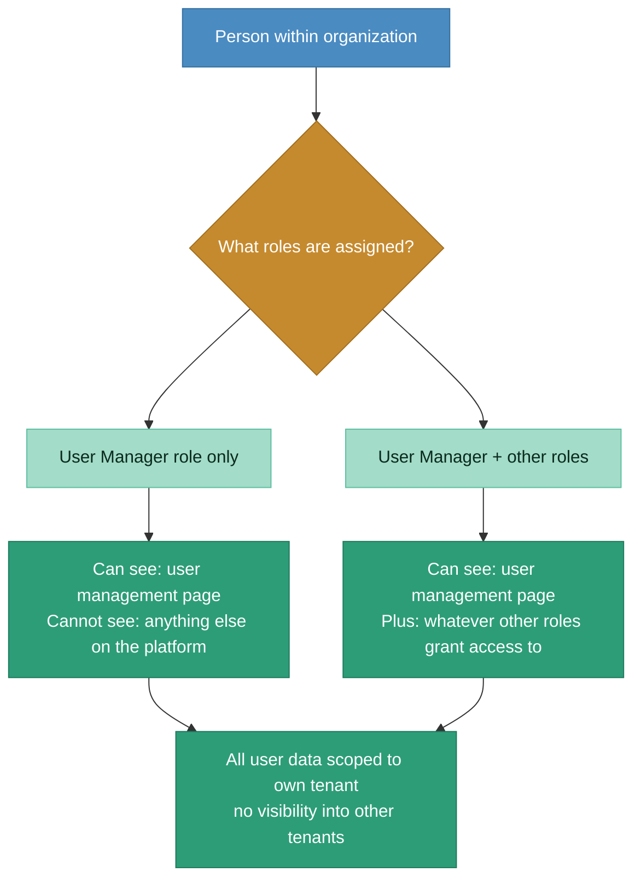
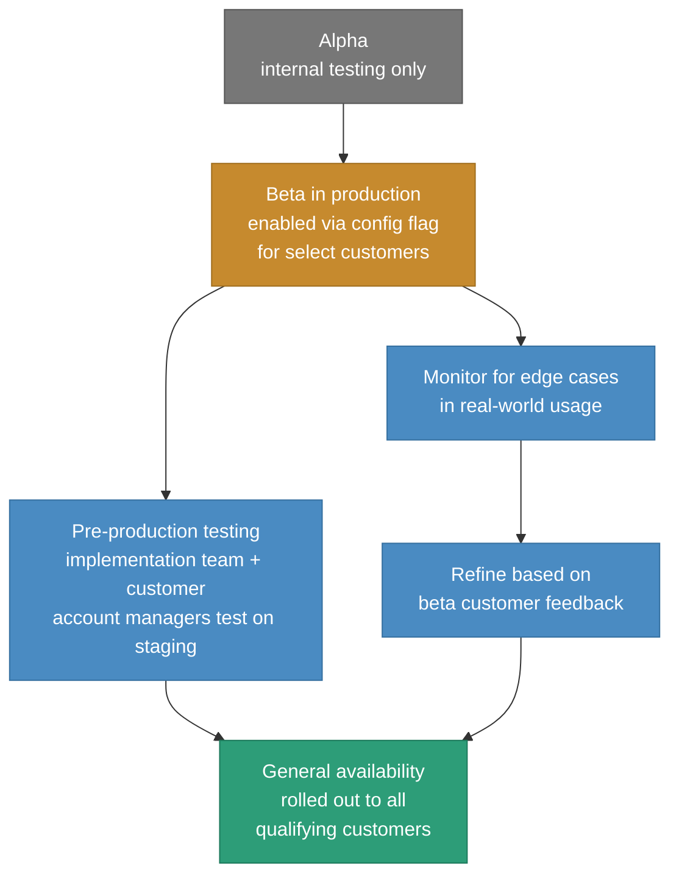
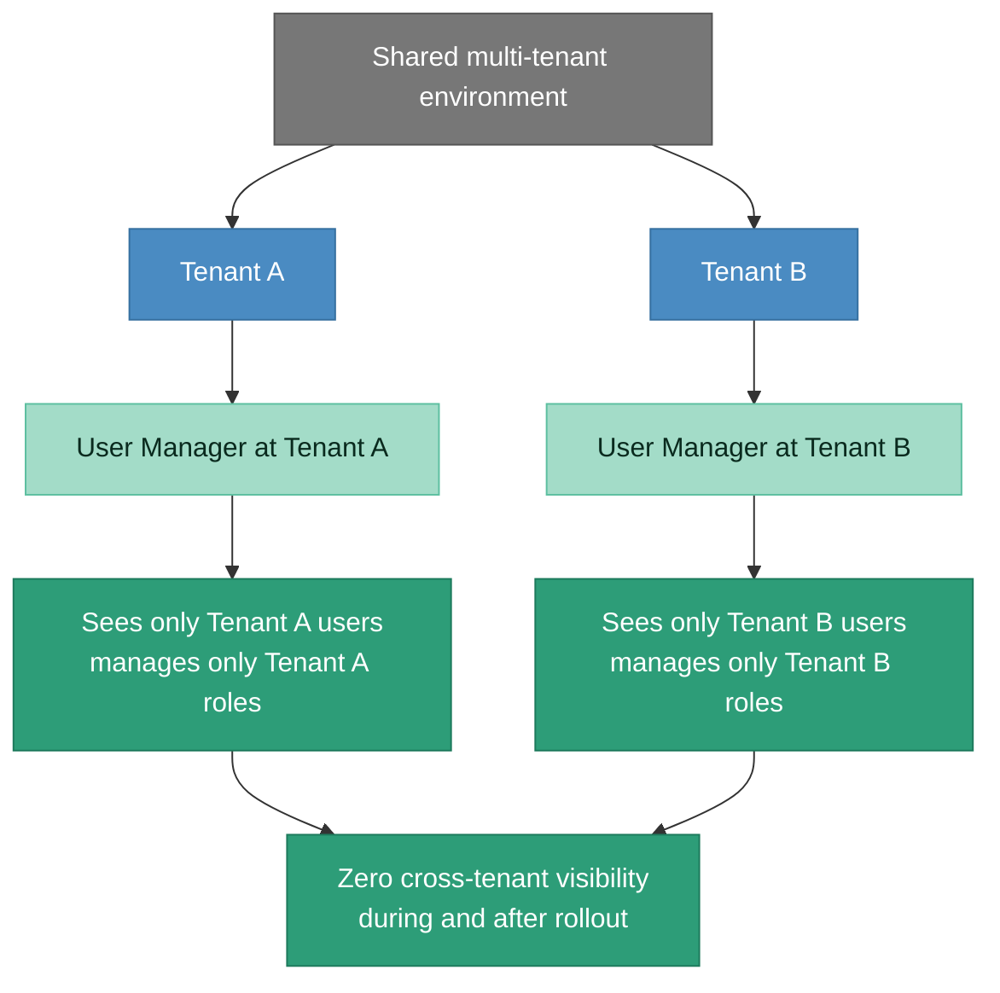

# After state: self-service RBAC with tenant-isolated user management

> Dedicated User Manager role scoped to user management only. Works for 50-user organizations and 100K+ user organizations without architectural changes. Zero cross-tenant data leaks. Implementation team freed from the most common support requests.

### How the User Manager role works

### Rollout via feature flags

### Multi-tenancy: how isolation is maintained

## Before vs. after comparison

| Dimension | Before | After |
|-----------|--------|-------|
| **User management process** | Every change requires a ticket to the implementation team | Self-service via dedicated User Manager role and interface |
| **Implementation team load** | Drowning in user change requests alongside core work | Most common user management requests eliminated from their queue |
| **Time to make a user change** | Days (waiting in queue) | Minutes (self-service) |
| **Access scope** | Only option was full admin access (too broad) or no access (status quo) | Dedicated User Manager role sees only the user management page, nothing else |
| **Role independence** | N/A | User Manager role works independently of other assigned roles. Having User Manager doesn't grant extra access. Having other roles doesn't grant user management. |
| **Tenant isolation** | Implicit (implementation team handled manually) | Enforced by design. Zero cross-tenant data leaks during or after rollout. |
| **Organizational scale** | Works the same for 50-user and 100K+ user organizations | Same architecture, no modifications needed per customer size |
| **Rollout approach** | N/A | Alpha, beta (feature flag in production), pre-production testing with implementation team and customer, then GA |
| **Customer satisfaction** | Frustrated. Paying significant fees but can't manage own people. | Self-reliant. Manage users on their own timeline without support queue. |

## Key architectural decisions

**Why a new dedicated role, not extending the existing admin workspace:**
The admin workspace had access to platform-level configuration, tenant settings, and system-wide controls. Exposing it to customers, even partially, created too large a blast radius. A dedicated User Manager role with its own page meant: if we got the scoping wrong, the worst case was a user management bug, not a platform configuration breach. Minimizing blast radius was the deciding factor.

**Why role independence matters:**
A person could be both a supply planner (with access to planning dashboards) and a user manager (with access to user administration). These roles had to work independently. Adding User Manager should not grant any planning access. Removing User Manager should not revoke planning access. This sounds simple but required careful RBAC architecture where roles were purely additive and scoped to their own page boundaries.

**Why feature flags, not a hard launch:**
At 100K+ users in multi-tenant environments, a bug in user management could have cascading effects: wrong users getting wrong access, tenant data leaking across boundaries, or the implementation team losing their ability to override. The alpha-beta-GA approach via feature flags meant we could test in production with select customers, monitor for edge cases in real-world usage, and roll back instantly if something went wrong. The cost of a slower rollout was weeks. The cost of a bad launch was customer trust.

**Why demo docs for every change:**
The implementation team was the first line of support for customers using the new self-service feature. They needed to know exactly what every button did, what every configuration option meant, and what the expected behavior was for every workflow. The click-through demo document I created (screenshots, step-by-step walkthrough, updated with every change no matter how small) became the most-referenced artifact in the organization. It reduced implementation team questions, accelerated customer training, and became a tool the implementation team could hand directly to customers.
