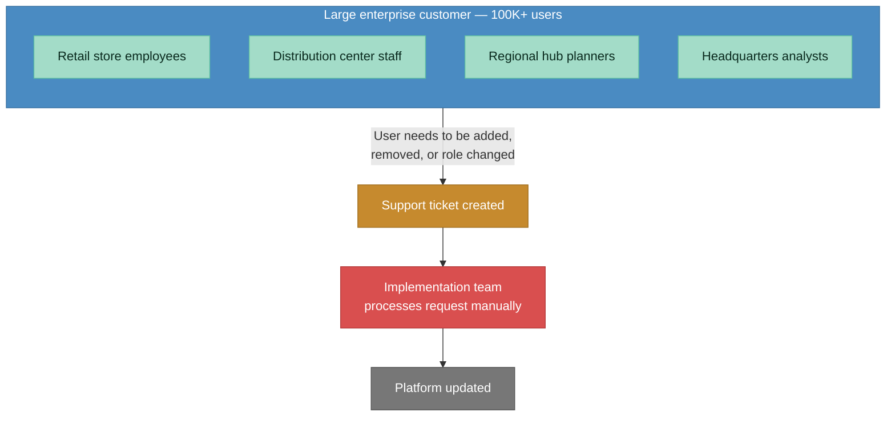
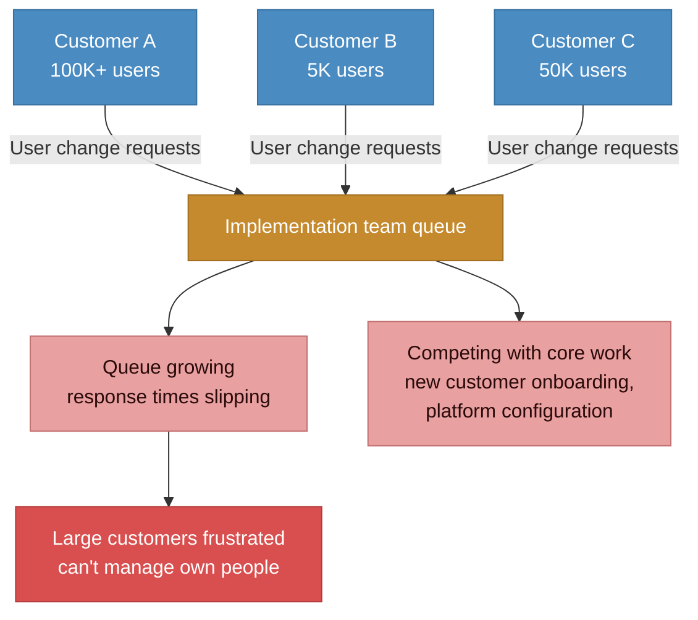
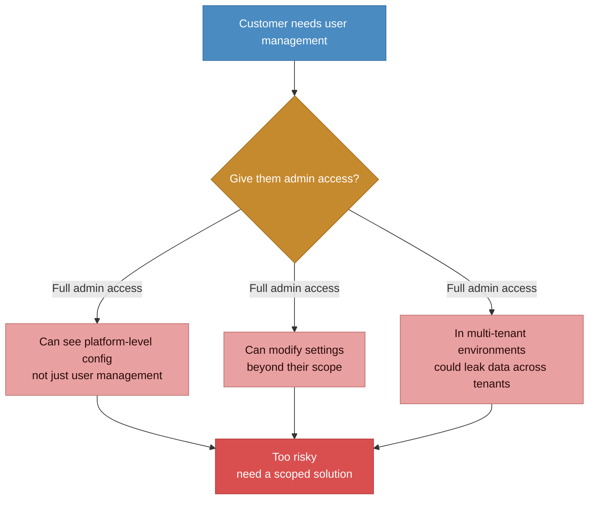
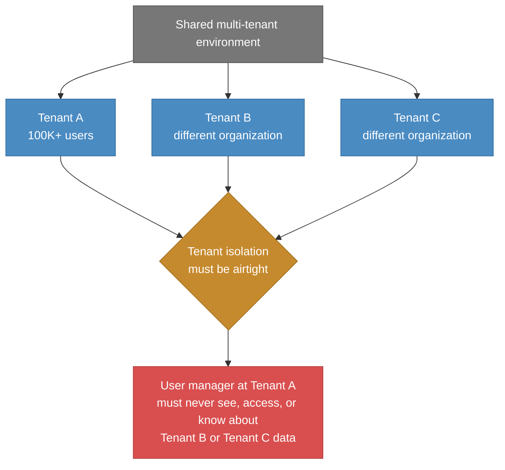

# Before state: manual user management at 100K+ scale

> Every user change required a ticket to the implementation team. One conglomerate alone had 100,000+ users across retail stores, distribution centers, and regional hubs. Personnel joining, leaving, changing roles daily. Queue growing, response times slipping.

### Why the implementation team was drowning

### Why "just add an admin page" wasn't the answer

### The multi-tenancy constraint

## Pain points summary

| Problem | Impact |
|---------|--------|
| **Every user change requires a ticket** | Adding, removing, or re-roling a user means filing a request to the implementation team. At 100K+ users with daily personnel changes, this is unsustainable. |
| **Implementation team stretched thin** | User management requests compete with core work: new customer onboarding, platform configuration, bug triage. Queue grows, response times slip. |
| **Large customers frustrated** | Enterprises paying significant platform fees cannot manage their own people without waiting in a support queue. |
| **Admin access is too broad** | Giving customers full admin access exposes platform-level configuration, settings beyond user management, and in multi-tenant environments, risks cross-tenant data leaks. |
| **Multi-tenancy makes scoping hard** | Any self-service user management must be airtight about tenant isolation. A user manager at Organization A must never see Organization B's data. |
| **Varied organizational structures** | Some customers have 50 users in one location. Others have 100K+ across retail, distribution, regional, and HQ levels. Solution must scale across both. |
